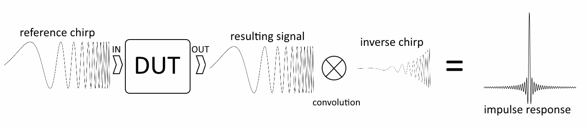

# ESS-Engine
An implementation of the impulse response measurement technique proposed by Prof. A.Farina.
The technique is based on exciting DUT (device under test) with exponential sine sweep (ESS) and deriving impulse response from the response by cross-correlation and some amplitude modulation.

Detailed description can be found here:
http://citeseerx.ist.psu.edu/viewdoc/download?doi=10.1.1.33.1614&rep=rep1&type=pdf
http://pcfarina.eng.unipr.it/Public/Papers/226-AES122.pdf

Later it was proposed an improvement to the method by Katja Vetter and Serafino di Rosario. The idea was to start and finish each octave of ESS signal in zero phase. It helped to reduce frequency response distortion.
https://www.uni-weimar.de/kunst-und-gestaltung/wiki/images/ExpoChirpToolbox-_a_Pd_implementation_of_ESS_impulse_response_measurement.pdf

Here is another description of the ESS-method (in russian):
https://habr.com/ru/post/471726/
